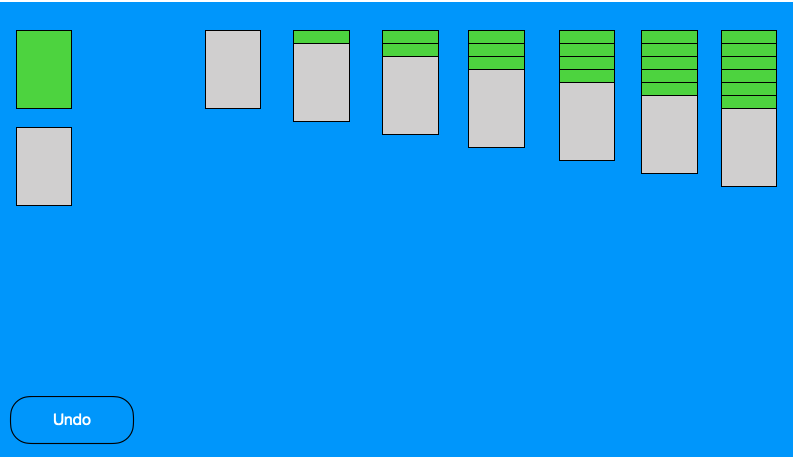

# Solitaire-JS
## Building classic solitaire in HTML,CSS and vanilla JS. 

1. Define required constants - and create card objects based on information found in array using class CARDS
    * 1 Using suite, color, value , a qunique name and unique id, create objects for later comparison
        * 1 For exampls, when using this method. I can finda match between Black Queen of Spades by assigning it a vlaye of 12, because the Red Jask of Diamonds will have a value of -11. I will subtract the absolute value of card a from the absolute value of card b, and check to see i the reults has an absolute value of 1.
2. Define required state variables - arrays will begin as empty, but hold the card information for each card, asd well as its placement on the board
    * 1 Let columnOneCards = [] We can then access the last card on the array, for example when checking for matches by: columneOneCards = [columnOneCards.length -1]
    * 2 Create a deck array, that will store the remaining cards
3. Upon loading, the app should do the following
    * 1 Initialize start variables
        * 1 Take cards array, and shuffle the order - Used before to shuffle cards for memory game
        * 2 Create objects using class CARDS
    * 2 Render gameboard ('div#gameBoard')
    * 3 Use created objects to render a decreasing number of cards in each column array
    * 4 Find the last card in each colum array, and set to active and re-render those to be face-up - changing their inner html using interpolation and the name of the card.
        * 1 I can set each img outside the game, so I can predict the name of the img, and inject it or remove it as necessary
    * 5 Check all face up cards for any possible matches (any cards that have a lower value, and an opposite color)
    * 6 Wait fro the player to click something
4. When a player clicks a card
    * 1 On the first click, do nothing
    * 2 On the second click, move the card to the array where the match has been found. Array.pop and array.push to update colum arrays as neccesary
    * 3 Render the page given the information in the column arrays.
    * Upon the case where a column, is empty. Any card can be placed in the empty column. By using pop and push, we will be updating the arrays after every move. 

